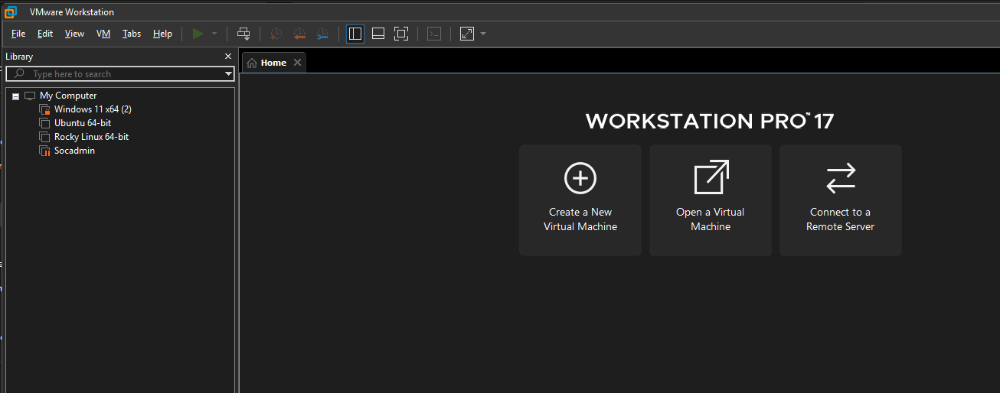

# Phase 1: Virtual Lab Foundation for SOC Analyst Home Lab

**Date:** Sept 30, 2026  
**Phase Completed:** Phase 1 - Virtual Lab Environment Setup  
---
Goal is build a safe, repeatable, isolated lab environment that could support future phases involving SIEM deployment, endpoint monitoring, IDS traffic analysis, Wazuh XDR, phishing investigation, SOC ticket writing, and attack simulation.

---


# 1. Purpose of Phase 1

A multiple systems that can communicate with each other in a controlled environment. In a real company, a SOC analyst reviews logs from endpoints, servers, firewalls, EDR tools, SIEM platforms, identity systems, and network security tools.

# 2. High-Level Lab Design

The initial Phase 1 lab design included three main virtual machines:

```text
Ubuntu SIEM VM       = Security monitoring / SIEM server
Windows 10 Victim VM = Endpoint being monitored and tested
Kali Linux VM        = Attacker/testing machine for later phases
```

Later phases added Wazuh as a separate VM, but Phase 1 focused on the original core environment.

## Phase 1 VM Roles

| VM | Role | Why It Exists |
|---|---|---|
| Ubuntu SIEM VM | Monitoring server | Hosts Elastic/Kibana/Fleet/Suricata in later phases |
| Windows 10 Victim VM | Endpoint | Generates logs, Sysmon telemetry, Windows events, user activity |
| Kali Linux VM | Testing/attacker box | Used later for scanning, traffic generation, and safe attack simulation |

---

# 3. VM 1 - Ubuntu SIEM VM

## Purpose

The Ubuntu SIEM VM was created to become the central security monitoring server. This VM to install:

- Elasticsearch
- Kibana
- Elastic Agent
- Fleet Server
- Suricata IDS
- Dashboards
- Log ingestion pipelines

# 4. VM 2 - Windows 10 Victim VM

## Purpose

The Windows 10 victim VM acts as the monitored endpoint.

This VM is where user and endpoint activity happens, installed:

- Sysmon
- Elastic Agent
- Wazuh Agent
- Windows logging integrations

This VM generated logs such as:

- Process creation
- DNS queries
- Network connections
- Login events
- Failed logons
- Account changes
- File activity
- PowerShell activity

# 5. VM 3 - Kali Linux VM

## Purpose

Kali Linux was included as the attacker/testing machine for later phases.

Later roadmap phases can use Kali for:

- Nmap scans
- Safe traffic generation
- Testing detection rules
- Simulated reconnaissance
- IDS alert generation
- Controlled attack exercises

## Install OpenSSH Server on both Linux system

If prompted, install OpenSSH server or install it later:

```bash
sudo apt update
sudo apt install -y openssh-server
```

Why:

```text
SSH allows easier copy/paste and administration from the host laptop.
```

# 6. Confirm IP Addresses on Linux, SIEM, Windows system

Run:

```bash
ip addr
```

Look for:

```text
NAT IP: usually 10.x.x.x
Host-only IP: usually 192.168.56.x
```


## Test Lab Connectivity

From Ubuntu SIEM to Windows:


From Windows to Ubuntu SIEM:

# 7. SSH Access to Ubuntu SIEM

Why SSH matters:

- Easier copy/paste
- Easier command execution
- More realistic Linux administration
- Better than typing long commands inside VMWare console

---

# 8. Why Snapshots Were Important

Snapshots were taken after clean setup milestones.

```text
Ubuntu SIEM:
Phase1-Clean-Ubuntu-Networking-Working

Windows 10 Victim:
Phase1-Clean-Windows-Networking-Working

Kali:
Phase1-Clean-Kali-Networking-Working
```

Why snapshots matter:

- Security tools can break configs.
- Package installs can fail.
- Network settings can get misconfigured.
- It is faster to revert than rebuild from scratch.
- Professional lab work requires rollback points.

---

# 9. Phase 1 Issues and Troubleshooting

## Issue 1 - Not enough space for set up SIEM Wazuh
Initially i have set a 4GB RAM and 1 core CPU but it start hanging while setting Wazuh. Fixed it by increase the hardware config to 6GB RAM and 2 core CPU

## Issue 2 - Need for SSH / Copy-Paste

Typing long commands directly into the VMWare console is inefficient and error-prone.

Resolution:

Install and use SSH for Linux VMs.

```bash
sudo apt install -y openssh-server
```

Then connect from host:

```powershell
ssh <username>@<host-only-ip>
```

Lesson:

```text
SSH improves workflow and mirrors real Linux administration.
```

---

## Issue 3 - Windows Firewall / Ping Behavior

set up a private lab is like create a small network within a virtual machine, ensure all machines can talk to each other
# 10. What Phase 1 Proved

By the end of Phase 1, the lab had a working virtual foundation.

Confirmed:

- VMWare installed and usable
- Ubuntu SIEM VM created
- Windows 10 victim VM created
- Kali Linux VM created or planned as attacker/testing machine
- NAT internet access configured
- Host-only lab network configured
- VMs could be assigned private lab IPs
- SSH access could be used for Linux administration
- Snapshots could protect progress
- The lab was ready for Elastic, Sysmon, Suricata, and Wazuh in future phases

---

# 11. Why Phase 1 Matters for SOC Analyst Skills

Phase 1 may look like basic setup, but it maps directly to real IT/security work.

A SOC analyst does not only look at alerts. They also need to understand:

- Hosts
- IP addressing
- Network paths
- Internal vs external traffic
- Firewalls
- Services
- Logs
- Troubleshooting
- System roles
- Endpoint vs server responsibilities

Phase 1 introduced those concepts through hands-on setup.

---

# 12. Interview Translation

A strong way to explain Phase 1 in an interview:

```text
I built a virtual SOC lab using VMWare with separate Ubuntu, Windows, and Kali virtual machines. I configured NAT networking for internet access and host-only networking for private lab communication. The Windows VM acts as the monitored endpoint, the Ubuntu VM acts as the SIEM server, and Kali is reserved for controlled testing and traffic generation. I validated connectivity using ipconfig, ip addr, ping, and SSH, then took clean snapshots before installing security tools. This gave me a safe environment to build Elastic, Wazuh, Sysmon, Suricata, and future SOC investigations without affecting my real network.
```

# 13. Phase 1 Checklist

Completed or established:

- VMWare used as the hypervisor
- Ubuntu SIEM VM created
- Windows 10 victim VM created
- Kali Linux testing VM created/planned
- NAT networking configured
- Host-only networking configured
- VM IP addresses identified
- Internet connectivity tested
- VM-to-VM connectivity tested
- SSH access established for Ubuntu
- Snapshot strategy established
- Lab roles defined
- Lab ready for Phase 2 Elastic/Sysmon/Suricata work

---

# 14. Final Phase 1 Summary

Phase 1 created the foundation for the entire SOC Analyst home lab. The lab was designed around a realistic security operations structure: a monitored Windows endpoint, an Ubuntu-based SIEM server, and a Kali testing machine. VMWare networking was configured with NAT for internet access and host-only networking for private lab communication.

The phase also introduced important troubleshooting concepts such as IP identification, adapter roles, ping behavior, firewall considerations, SSH access, and snapshot management. This foundation made the later phases possible, including Elastic SIEM deployment, Sysmon telemetry, Suricata IDS, Wazuh XDR, ticket writing, and SOC investigation practice.

Phase 1 is complete.
